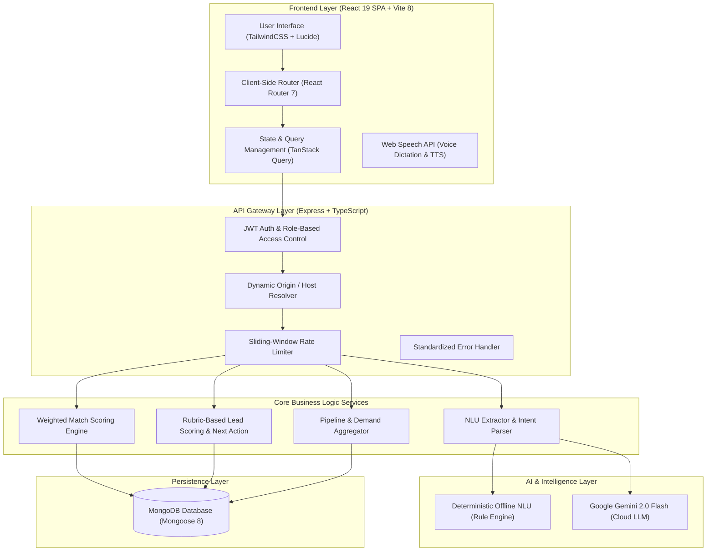
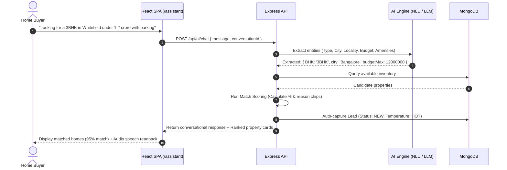
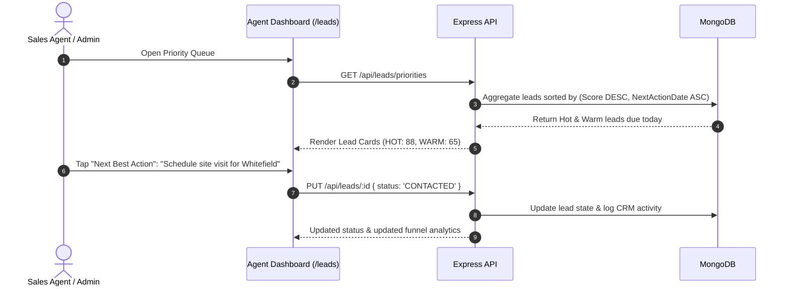

# 🏢 PropIntel AI — Intelligent Real Estate Intelligence & CRM Platform

<p align="center">
  <strong>An enterprise-grade, full-stack AI platform bridging conversational property discovery for buyers and automated lead intelligence CRM for real estate sales teams.</strong>
</p>

<p align="center">
  
  
  
  
  
  
  
  
</p>

---

## 📑 Table of Contents

- [Executive Summary](#-executive-summary)
- [System Architecture](#-system-architecture)
- [End-to-End User Workflows](#-end-to-end-user-workflows)
  - [1. Buyer Journey (Conversational Search & Discovery)](#1-buyer-journey-conversational-search--discovery)
  - [2. Sales Agent & Admin Journey (Lead Intelligence CRM)](#2-sales-agent--admin-journey-lead-intelligence-crm)
- [Core AI Algorithms & Mathematical Rubrics](#-core-ai-algorithms--mathematical-rubrics)
  - [A. Natural Language Understanding (NLU) & Entity Extraction](#a-natural-language-understanding-nlu--entity-extraction)
  - [B. Multi-Criteria Match Scoring Algorithm](#b-multi-criteria-match-scoring-algorithm)
  - [C. Automated 4-Tier Lead Scoring Rubric](#c-automated-4-tier-lead-scoring-rubric)
- [Database Entity Relationship Model](#-database-entity-relationship-model)
- [Technology Stack Matrix](#-technology-stack-matrix)
- [Getting Started & Local Setup](#-getting-started--local-setup)
- [Pre-Seeded Demo Accounts](#-pre-seeded-demo-accounts)
- [Complete REST API Specification](#-complete-rest-api-specification)
- [Production Deployment Guide](#-production-deployment-guide)
- [Monorepo Directory Structure](#-monorepo-directory-structure)
- [Security & Architecture Principles](#-security--architecture-principles)

---

## 🌟 Executive Summary

In traditional real estate, property search portals and customer relationship management (CRM) tools operate in isolated silos. High-intent buyers are forced through rigid dropdown forms, while sales teams receive unqualified, cold leads with zero context.

**PropIntel AI** bridges this gap:
1. **For Home Seekers**: A frictionless, natural language assistant that parses complex human queries (including Indian currency notations like `90 lakh`, `1.5 crore`), maintains multi-turn conversation memory, ranks inventory with transparent match explanations, and supports voice dictation.
2. **For Sales Teams**: An autonomous lead capture and intelligence engine that scores inbound buyer requirements, identifies hot opportunities (Score 80–100), recommends next best sales actions, and provides executive-level pipeline analytics.

---

## 🏗️ System Architecture



---

## 🔄 End-to-End User Workflows

### 1. Buyer Journey (Conversational Search & Discovery)



### 2. Sales Agent & Admin Journey (Lead Intelligence CRM)



---

## 🧠 Core AI Algorithms & Mathematical Rubrics

### A. Natural Language Understanding (NLU) & Entity Extraction

The NLU engine converts unstructured human text into structured query objects:
- **Budget Parser**: Normalizes Indian financial expressions:
  - `"1.2 cr"` / `"1.2 crore"` $\rightarrow 12,000,000$ INR
  - `"80 lakh"` / `"80L"` / `"80 lac"` $\rightarrow 8,000,000$ INR
  - `"under 50k / month"` $\rightarrow 50,000$ INR (`RENT` intent)
- **Configuration Normalizer**: Normalizes `"3 bed"`, `"3 bedroom"`, `"3bhk"` $\rightarrow `3BHK`$.
- **Locality Matcher**: Extracts localities and maps to respective metropolitan regions (e.g. *Whitefield, Indiranagar, HSR Layout $\rightarrow$ Bangalore*).

---

### B. Multi-Criteria Match Scoring Algorithm

For any property $P$ evaluated against user criteria $C$, the match score $S \in [0, 100]$ is computed as:

$$\text{MatchScore}(P, C) = w_{\text{type}} \cdot S_{\text{type}} + w_{\text{loc}} \cdot S_{\text{loc}} + w_{\text{budget}} \cdot S_{\text{budget}} + w_{\text{amenities}} \cdot S_{\text{amenities}}$$

| Component | Weight ($w$) | Scoring Criteria |
|---|:---:|---|
| **Property Type / BHK** | **35%** | Exact BHK match = $1.0$, $\pm 1$ bedroom tolerance = $0.5$, mismatch = $0.0$ |
| **Locality & City** | **30%** | Exact locality match = $1.0$, same city = $0.7$, nearby region = $0.4$ |
| **Budget Alignment** | **25%** | Price $\le$ max budget = $1.0$; linearly scales down up to $+20\%$ budget tolerance |
| **Amenities & Features** | **10%** | Jaccard similarity index of requested vs. available amenities |

---

### C. Automated 4-Tier Lead Scoring Rubric

Inbound leads are scored dynamically from **0 to 100** across 6 weighted behavioral and demographic signals:

$$\text{LeadScore} = S_{\text{budget}} (25) + S_{\text{locality}} (20) + S_{\text{bhk}} (15) + S_{\text{timeline}} (15) + S_{\text{visit}} (15) + S_{\text{contact}} (10)$$

```
┌─────────────────┬─────────────┬──────────────────────────────────────────────────────┐
│ Temperature     │ Score Range │ Autonomous System Action                             │
├─────────────────┼─────────────┼──────────────────────────────────────────────────────┤
│ 🔥 HOT          │ 80 – 100    │ Instant agent alert • 1-hour priority callback SLA   │
│ ☀️ WARM         │ 50 – 79     │ Scheduled follow-up • Curated property recommendations│
│ 🌱 NURTURE      │ 25 – 49     │ Automated drip email • Weekly market price digest    │
│ ❄️ COLD         │ 0 – 24      │ Low engagement archive • Re-engagement campaigns     │
└─────────────────┴─────────────┴──────────────────────────────────────────────────────┘
```

---

## 🗄️ Database Entity Relationship Model

```text
┌─────────────────────────┐         ┌─────────────────────────┐
│          User           │         │        Property         │
├─────────────────────────┤         ├─────────────────────────┤
│ _id: ObjectId           │1       *│ _id: ObjectId           │
│ name: String            │─────────│ title: String           │
│ email: String (Unique)  │         │ price: Number           │
│ role: CUSTOMER | ADMIN  │         │ city / locality: String │
│ phone: String           │         │ propertyType: String    │
│ passwordHash: String    │         │ amenities: [String]     │
└───────────┬─────────────┘         │ status: AVAILABLE...    │
            │1                      └────────────┬────────────┘
            │                                    │1
            │*                                   │*
┌───────────┴─────────────┐         ┌────────────┴────────────┐
│      Conversation       │         │        SiteVisit        │
├─────────────────────────┤         ├─────────────────────────┤
│ _id: ObjectId           │         │ _id: ObjectId           │
│ customerId: ObjectId    │         │ customerId: ObjectId    │
│ messages: [Message]     │         │ propertyId: ObjectId    │
│ extractedReqs: Object   │         │ date: String            │
│ detectedIntent: String  │         │ time: String            │
└─────────────────────────┘         │ status: REQUESTED...    │
            │1                      └─────────────────────────┘
            │                                    │
            │1                                   │1
┌───────────┴─────────────┐                      │
│          Lead           │                      │
├─────────────────────────┤                      │
│ _id: ObjectId           │                      │
│ customerId: ObjectId    │                      │
│ leadScore: Number (0-100)                      │
│ temperature: HOT/WARM...│                      │
│ status: NEW/CONTACTED...│                      │
│ nextAction: Object      │                      │
└─────────────────────────┘                      │
            │1                                   │
            │*                                   │*
┌───────────┴────────────────────────────────────┴────────────┐
│                          Activity                           │
├─────────────────────────────────────────────────────────────┤
│ _id: ObjectId | type: CHAT | VISIT | SAVED | STATUS_CHANGE  │
│ actorId: ObjectId | description: String | timestamp: Date   │
└─────────────────────────────────────────────────────────────┘
```

---

## 💻 Technology Stack Matrix

| Category | Technology | Purpose |
|---|---|---|
| **Frontend Framework** | **React 19** + **TypeScript** | High-performance reactive UI with functional components & strict type safety |
| **Build Tooling** | **Vite 8** | Sub-second HMR and optimized production asset chunking |
| **Styling & Design** | **TailwindCSS 3.4** | Modern design system, fluid typography, dark glassmorphism, responsive grids |
| **Data Fetching** | **TanStack Query 5** | Server-state caching, automatic cache invalidation, and optimistic UI |
| **Voice Engine** | **Web Speech API** | Hands-free speech-to-text dictation and synthesized voice response playback |
| **Visual Charts** | **Recharts 3** | Interactive conversion funnels, temperature distribution, and demand charts |
| **Backend Runtime** | **Node.js 20+** + **Express 4** | Modular RESTful API architecture with middleware pipelines |
| **Database & ODM** | **MongoDB** + **Mongoose 8** | Schema validation, indexing, ACID transactions, and aggregation pipelines |
| **Authentication** | **JWT** + **Bcrypt.js** | Stateless Bearer token authentication with role-based route guards |
| **AI Providers** | **Dual-Engine (Gemini + Offline)** | Pluggable architecture: deterministic rule-based engine or Google Gemini 2.0 Flash |

---

## ⚡ Getting Started & Local Setup

### Prerequisites
- **Node.js**: `v18.0.0` or higher (`v20.x` recommended)
- **MongoDB**: Community Server running locally on `localhost:27017` (or MongoDB Atlas cloud URI)
- **Git**

---

### Step 1: Clone Repository
```bash
git clone https://github.com/ARJUN1026/PropIntel_AI.git
cd PropIntel_AI
```

### Step 2: Configure & Start Backend API
```bash
cd server

# Install dependencies
npm install

# Setup environment variables
cp .env.example .env

# Populate database with realistic demo properties, leads, and analytics
npm run seed

# Launch Express backend
npm run dev
```
> Server running at: [**http://localhost:5000**](http://localhost:5000)  
> API Health status: [**http://localhost:5000/health**](http://localhost:5000/health)

### Step 3: Configure & Start Frontend Web App
```bash
# Open a new terminal tab
cd client

# Install dependencies
npm install

# Launch Vite development server
npm run dev
```
> Web application active at: [**http://localhost:5173**](http://localhost:5173)

---

## 🔑 Pre-Seeded Demo Accounts

Test the platform instantly using pre-populated roles:

| Role | Email | Password | Access Level |
|---|---|---|---|
| **Admin / Sales Lead** | `admin@propintel.ai` | `Admin@123` | Full CRM Suite, Pipeline Funnel, Lead Scoring, Inventory Management |
| **Sales Agent (North)** | `amit@propintel.ai` | `Admin@123` | Agent Workstation, Assigned Lead Triage, Site Visit Coordination |
| **Sales Agent (South)** | `priya@propintel.ai` | `Admin@123` | Agent Workstation, Lead Pipeline, Contact History |
| **Buyer / Customer** | `rahul@example.com` | `Customer@123` | AI Assistant Search, Recommendations, Book Visits, Saved Properties |
| **Buyer / Customer** | `priya.c@example.com` | `Customer@123` | Customer Dashboard, Saved Homes, Booking Management |

---

## 📡 Complete REST API Specification

### Authentication & User Endpoints
| Method | Endpoint | Access | Description |
|---|---|:---:|---|
| `POST` | `/api/auth/register` | Public | Register customer or agent account |
| `POST` | `/api/auth/login` | Public | Authenticate user & issue JWT bearer token |
| `GET` | `/api/auth/me` | Authenticated | Fetch current authenticated user profile |

### Property Catalog Endpoints
| Method | Endpoint | Access | Description |
|---|---|:---:|---|
| `GET` | `/api/properties` | Authenticated | Paginated property list with dynamic multi-field filters |
| `GET` | `/api/properties/:id` | Authenticated | Single property details with amenity checklist |
| `POST` | `/api/properties` | Admin | Create a new property listing |
| `PUT` | `/api/properties/:id` | Admin | Update property details or pricing |
| `DELETE` | `/api/properties/:id` | Admin | Remove property listing |

### AI & Assistant Endpoints
| Method | Endpoint | Access | Description |
|---|---|:---:|---|
| `POST` | `/api/ai/property-search` | Authenticated | Parse natural language text into criteria & rank properties |
| `POST` | `/api/ai/recommend-properties` | Authenticated | Context-grounded recommendations for active customer |
| `POST` | `/api/ai/chat` | Authenticated | Multi-turn chat assistant with auto lead capture |
| `GET` | `/api/ai/conversations` | Authenticated | Fetch user conversation history |
| `GET` | `/api/ai/conversations/:id` | Authenticated | Fetch conversation messages & metadata |
| `POST` | `/api/ai/compare-properties` | Authenticated | Generate side-by-side AI comparison analysis |

### Lead Intelligence & CRM Endpoints
| Method | Endpoint | Access | Description |
|---|---|:---:|---|
| `GET` | `/api/leads` | Admin | List leads filtered by status, temperature, or agent |
| `GET` | `/api/leads/priorities` | Admin | Fetch triage queue of leads due for follow-up today |
| `GET` | `/api/leads/:id` | Admin | Lead detail with score breakdown & recommended action |
| `POST` | `/api/leads/:id/score` | Admin | Trigger real-time rubric re-scoring |
| `PUT` | `/api/leads/:id` | Admin | Update lead status, notes, or assignment |

### Site Visits & Collections Endpoints
| Method | Endpoint | Access | Description |
|---|---|:---:|---|
| `GET` | `/api/site-visits` | Authenticated | List scheduled customer / agent site visits |
| `POST` | `/api/site-visits` | Customer | Request site visit for a property |
| `PUT` | `/api/site-visits/:id` | Admin | Confirm, reschedule, or complete visit |
| `GET` | `/api/saved` | Authenticated | Get bookmarked property collection |
| `POST` | `/api/saved/:propertyId` | Authenticated | Add property to saved collection |
| `DELETE` | `/api/saved/:propertyId` | Authenticated | Remove property from saved collection |

### Executive Analytics Endpoints
| Method | Endpoint | Access | Description |
|---|---|:---:|---|
| `GET` | `/api/analytics/overview` | Admin | Pipeline KPIs, active counts, and overall conversion rate |
| `GET` | `/api/analytics/leads` | Admin | Stage conversion funnel & temperature breakdown |
| `GET` | `/api/analytics/properties` | Admin | City inventory distribution and average price / sq.ft |
| `GET` | `/api/analytics/agents` | Admin | Agent performance leaderboard and conversion metrics |
| `GET` | `/api/analytics/demand` | Admin | High-demand localities, configurations, and budget clusters |

---

## 🚀 Production Deployment Guide

PropIntel AI is production-ready for deployment across cloud platforms:

```text
┌──────────────────────────────────────┐
│       Frontend (Vercel)              │
│       https://propintel.vercel.app   │
└──────────────────┬───────────────────┘
                   │ HTTPS API Calls (VITE_API_URL)
                   ▼
┌──────────────────────────────────────┐
│       Backend (Render / Railway)     │
│  https://propintel-api.onrender.com  │
└──────────────────┬───────────────────┘
                   │ Mongoose Connection (MONGODB_URI)
                   ▼
┌──────────────────────────────────────┐
│      MongoDB Atlas (Cloud M0 Free)   │
│ mongodb+srv://.../propintel          │
└──────────────────────────────────────┘
```

### Production Checklist
1. **Frontend Hosting ([Vercel](https://vercel.com))**:
   - Framework preset: `Vite`
   - Root directory: `client`
   - Build command: `npm run build`
   - Output directory: `dist`
   - Environment Variable: `VITE_API_URL=https://your-backend.onrender.com/api`
   - Includes `client/vercel.json` SPA rewrite rules.
2. **Backend Hosting ([Render](https://render.com) / [Railway](https://railway.app))**:
   - Root directory: `server`
   - Build command: `npm install && npm run build`
   - Start command: `npm start`
   - Environment Variables: `MONGODB_URI`, `JWT_SECRET`, `CORS_ORIGIN`, `AI_PROVIDER`.
   - Includes 1-click `render.yaml` blueprint and `server/railway.json`.
3. **Database ([MongoDB Atlas](https://www.mongodb.com/atlas))**:
   - Free Tier M0 cluster with Network Access allowed from `0.0.0.0/0`.

👉 **For the complete step-by-step walkthrough, see [DEPLOYMENT.md](DEPLOYMENT.md).**

---

## 📁 Monorepo Directory Structure

```text
PropIntel AI/
├── client/                     # Frontend Application (React 19 + Vite 8)
│   ├── src/
│   │   ├── auth/               # AuthContext, Token Storage, Protected Route Guards
│   │   ├── components/         # AppShell, PropertyCard, ChatWidget, UI Primitives
│   │   ├── pages/              # Assistant, Browse, Dashboard, Leads, Analytics, Saved
│   │   ├── lib/                # UI utilities, formatting, tone styling
│   │   ├── api.ts              # Axios interceptors & typed API SDK methods
│   │   ├── types.ts            # Data models & interface contracts
│   │   └── main.tsx            # Application entrypoint & React Query provider
│   ├── vercel.json             # Vercel SPA routing rewrite rules
│   ├── vite.config.ts          # Vite build & plugin configurations
│   └── package.json            # Frontend dependencies
│
├── server/                     # Backend API Service (Express + TypeScript)
│   ├── src/
│   │   ├── config/             # DB connection lifecycle & environment validator
│   │   ├── controllers/        # Route handler business logic
│   │   ├── middleware/         # JWT Auth, Role Guard, Rate Limiter, Error Handler
│   │   ├── models/             # Mongoose schemas & indexes
│   │   ├── routes/             # RESTful API route definitions
│   │   ├── services/
│   │   │   ├── ai/             # NLU parser, Match engine, Gemini client
│   │   │   ├── lead/           # Lead scoring rubric & capture service
│   │   │   └── analytics/      # Aggregation pipeline processors
│   │   └── server.ts           # Server initialization & host binding (0.0.0.0)
│   ├── scripts/                # Database seed scripts
│   ├── Dockerfile              # Multi-stage production container
│   ├── Procfile                # Web process definition for PaaS
│   ├── railway.json            # Railway deployment configuration
│   └── package.json            # Backend dependencies
│
├── DEPLOYMENT.md               # Production deployment guide
├── render.yaml                 # 1-Click Render blueprint
├── vercel.json                 # Monorepo root Vercel configuration
├── .gitignore                  # Git ignore rules
└── README.md                   # Comprehensive project documentation
```

---

## 🔒 Security & Architecture Principles

- **Zero Client-Side Secrets**: All LLM API keys and database connection strings are strictly isolated on the backend server.
- **Role-Based Access Control (RBAC)**: Distinct permissions enforced at both the API controller layer (`requireRole('ADMIN')`) and UI navigation layer (`RequireAuth`).
- **Cryptographic Password Hashing**: Passwords salted and hashed with `bcryptjs`.
- **CORS Regex Protection**: Strict origin verification with dynamic development localhost fallback and whitespace trimming.
- **Defensive Error Handling**: Uniform `ApiError` format prevents internal database stack trace leaks to client responses.

---

## 📄 License

This project is licensed under the [MIT License](LICENSE).
